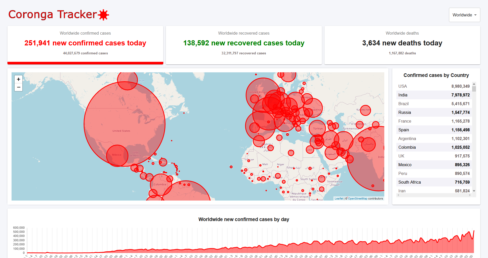

   

  <a href="#movie_camera-preview" color="ff0000">Preview</a>&nbsp;&nbsp;&nbsp;|&nbsp;&nbsp;&nbsp;
  <a href="#file_folder-demo-website" color="ff0000">Demo Website</a>&nbsp;&nbsp;&nbsp;|&nbsp;&nbsp;&nbsp;
  <a href="#books-technologies" color="ff0000">Technologies</a>&nbsp;&nbsp;&nbsp;|&nbsp;&nbsp;&nbsp;
  <a href="#computer-project" color="ff0000">Project</a>&nbsp;&nbsp;&nbsp;|&nbsp;&nbsp;&nbsp;
  <a href="#green_book-how-to-run" color="ff0000">How to Run</a>

	
   
  

  

## :movie_camera: Preview
  

## :file_folder: Demo Website
You can acess the website at:     
👉  Demo: https://coronga-tracker.web.app/

## :books: Technologies

This project was made using the follow technologies:

- [React](https://reactjs.org)

## :computer: Project
 👾📊  Coronga Tracker is a react project created to observe and analyze the cases, recoveries and deaths caused by covid-19. 📊👾 
 
## :green_book: How to run

### Clone Repository
$ git clone https://github.com/antoniovictormt/Coronga-Tracker.git

### Run Web Project

* Install Dependencies
 $ yarn install

* Run Aplication
 $ yarn start

Go to http://localhost:3000/ to see the result.
